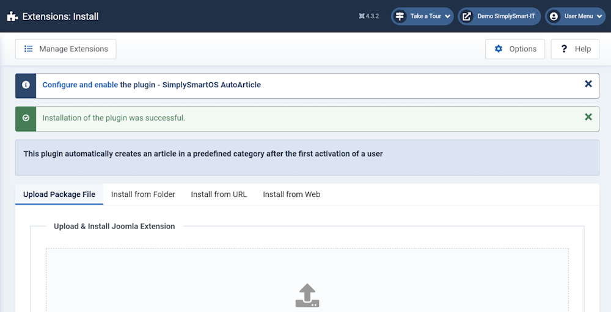
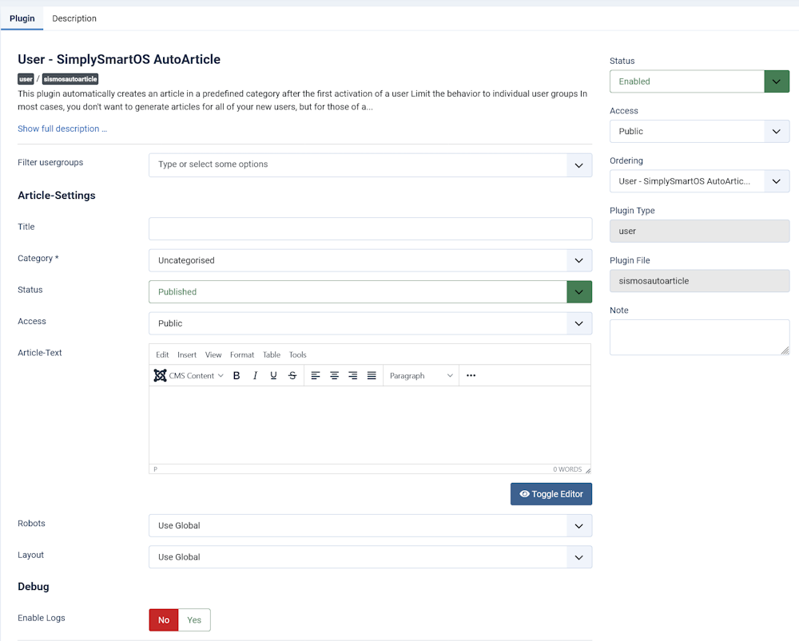

<h1 align="center">SimplySmart AutoArticle Plugin for Joomla</h1><h2 align="center">Martina Scholz - SimplySmart Open Source</h2>

  

  

<!-- Status -->

<h4 align="center"> 
	  SimplySmart AutoArticle Plugin for Joomla
</h4> 

  <a href="#sparkles-about">About</a> &#xa0; | &#xa0;
  <a href="#mag_right-technologies">Technologies</a> &#xa0; | &#xa0;
  <a href="#white_check_mark-requirements">Requirements</a> &#xa0; | &#xa0;
  <a href="#checkered_flag-starting">Let's start</a> &#xa0; | &#xa0;
  <a href="#memo-license">License</a> &#xa0; | &#xa0;
  <a href="https://github.com/SimplySmart-IT" target="_blank">Author</a>

 

## :sparkles: About ##

**This Plugin is useful to automatically create an article for a new user on activation in your Joomla! 4 CMS.**

:heavy_check_mark: Set default options for the new user article in plugin settings\
:heavy_check_mark: New article for the user is created automatically on activation\
:heavy_check_mark: Limit the behavior to individual user groups

&#xa0;

## :white_check_mark: Requirements ##

In order to be able to use this plugin, you need a Joomla! installation in version 4 or higher ([Joomla](https://www.joomla.org/)[^1] - [Joomla auf Deutsch](https://www.joomla.de/))[^1].

&#xa0;

## :checkered_flag: Let's start ##

The plugin is available for download as stable version 1.0.2.

[:link: Download v1.0.2](https://simplysmart-it.de/downloads/sismos-autoarticle/1_0_2)

### Step 1 - Install and activate the plugin

Installation of the plugin as usual in the installation manager of Joomla.
Enable and configure the plugin according to your needs.

### Step 2 - Configure the default article settings

<h4>Limit the behavior to individual user groups</h4>

In most cases, you don't want to generate articles for all of your new users, but for those of a specific user group. You can limit the behavior to individual user groups using the Filter user groups field. The default behavior is to create an article for all new users. It is highly recommended to limit this to the user groups you need.

<h4>Article title and alias</h4>

The standard article title from the plugin settings is optional and automatically supplemented with the name of the new user.
The alias is automatically generated from the username. If a name occurs twice, a numeric string is appended to the alias.

<h4>Define default values ​​for new user article</h4>

All default values ​​defined in the plugin settings are automatically applied to newly created user articles.
A change in the plugin settings has no retroactive effect on previously created articles.
The values ​​can be changed at any time in the respective article.

<h4>Troubleshooting</h4>

In case of problems, logging can be enabled by changing the <i>Enable Logs</i> option. After activation, the log file can be found in the path <i>administrator/logs/plg_user_sismosautoarticle.php</i>.

&#xa0;

&#xa0;

## Your support
<b>This plugin is mainly sponsored by [@coolcat-creations](https://github.com/coolcat-creations) </b>

Would you like to support me and my future developments?!? :tada::rocket: Thank you very much !!! :heart:

&#xa0;

## :mag_right: Technologies ##

The following tools were used to create this project:

- [Joomla](https://www.joomla.org/)[^1]
- [Digital-Peak/DPDocker](https://github.com/Digital-Peak/DPDocker)

## :memo: License ##

This project is under GNU General Public License version 3 or later;. For more details, see the [LICENSE](LICENSE.md) file.

Made with :heart: by <a href="https://github.com/SimplySmart-IT" target="_blank">Martina Scholz</a>

&#xa0;

[^1]: This plugin - SimplySmart AutoArticle for Joomla - is not affiliated with or endorsed by The Joomla! Project™. Any products and services provided through this site are not supported or warrantied by The Joomla! Project or Open Source Matters, Inc. Use of the Joomla!® name, symbol, logo and related trademarks is permitted under a limited license granted by Open Source Matters, Inc.

<a href="#top">Back to top</a>
